# 目录
- [目录](#目录)
- [Ubuntu22.04利用lightdm替换gdm3出现的问题或Bug](#ubuntu2204利用lightdm替换gdm3出现的问题或bug)
  - [查看当前屏幕管理器](#查看当前屏幕管理器)
  - [查看当前桌面环境](#查看当前桌面环境)
  - [切换屏幕管理器](#切换屏幕管理器)
  - [推荐下载lightdm屏幕管理器](#推荐下载lightdm屏幕管理器)
  - [修复lightdm无法锁屏的问题](#修复lightdm无法锁屏的问题)
- [输入法无法切换中文](#输入法无法切换中文)
  - [解决方案](#解决方案)
  - [参考链接](#参考链接)
- [开机遇到grub\>](#开机遇到grub)
  - [双系统开机到grub的解决](#双系统开机到grub的解决)
- [Linux安装MySQL](#linux安装mysql)
  - [Linux/UNIX 上安装 MySQL](#linuxunix-上安装-mysql)
  - [完全卸载MYSQL](#完全卸载mysql)
      - [先卸载 mysql-common](#先卸载-mysql-common)
      - [然后再卸载](#然后再卸载)
      - [最后清除残留数据](#最后清除残留数据)
  - [修改数据库配置文件绕过密码登录](#修改数据库配置文件绕过密码登录)
  - [修改MYSQL 用户密码](#修改mysql-用户密码)
  - [MYSQL无法读取本地文件文件](#mysql无法读取本地文件文件)
  - [安全设置](#安全设置)
  - [修改AppArmor配置文件](#修改apparmor配置文件)
  - [取消禁用AppArmor服务](#取消禁用apparmor服务)
    - [1. 启用 AppArmor 服务：](#1-启用-apparmor-服务)
    - [2. 启动 AppArmor 服务：](#2-启动-apparmor-服务)
    - [3. 检查 AppArmor 状态：](#3-检查-apparmor-状态)
    - [4. 重新加载 AppArmor 配置（可选）：](#4-重新加载-apparmor-配置可选)
    - [禁用 AppArmor 服务：](#禁用-apparmor-服务)
    - [卸载 AppArmor 软件包：](#卸载-apparmor-软件包)
    - [mysql的读取](#mysql的读取)
    - [修改mysql配置文件](#修改mysql配置文件)
- [GIT](#git)
  - [别名](#别名)
  - [git fatal: 拒绝合并无关的历史](#git-fatal-拒绝合并无关的历史)
- [QT6.61](#qt661)
  - [安装完打不开的问题](#安装完打不开的问题)
      - [解决Qt出现qt.qpa.plugin:Could not load the Qt platform plugin "xcb"](#解决qt出现qtqpaplugincould-not-load-the-qt-platform-plugin-xcb)
    - [定位问题](#定位问题)
    - [解决方法](#解决方法)
- [PDF转图片](#pdf转图片)
  - [**将PDF文档转成图片**](#将pdf文档转成图片)
  - [**将指定范围内的页面转成图片**](#将指定范围内的页面转成图片)
  - [**将pdf文件的第一页转成图片**](#将pdf文件的第一页转成图片)
  - [**调整转换图片的DPI质量**](#调整转换图片的dpi质量)
- [强制结束程序](#强制结束程序)
  - [找到程序运行的进程号](#找到程序运行的进程号)
  - [杀死进程](#杀死进程)

# Ubuntu22.04利用lightdm替换gdm3出现的问题或Bug

## 查看当前屏幕管理器

```shell
cat /etx/X11/default-display-manager
```

## 查看当前桌面环境

```shell
echo $DESKTOP_SESSION 
```

## 切换屏幕管理器

```shell
sudo dpkg-reconfigure gdm3
sudo dpkg-reconfigure lightdm
```

## 推荐下载lightdm屏幕管理器

```shell
sudo apt-get install lightdm
```

## 修复lightdm无法锁屏的问题

```shell
gsettings get org.gnome.desktop.lockdown disable-lock-screen
```

检查disable-lock-screen属性，若输出false则是正常，如果返回值是True，则输入下面命令：

```shell
gsettings set org.gnome.desktop.lockdown disable-lock-screen false
```

更改为flase，

输入下面命令看是否可以锁屏：

```shell
dm-tool lock
```

若可以实现锁屏，就是图形界面是lightdm而不是gdm3，使用了lightdm 桌面管理器，导致锁屏命令变化，即：设置->键盘快捷键->添加自定义快捷键：

禁用原锁屏键


自定义快捷键

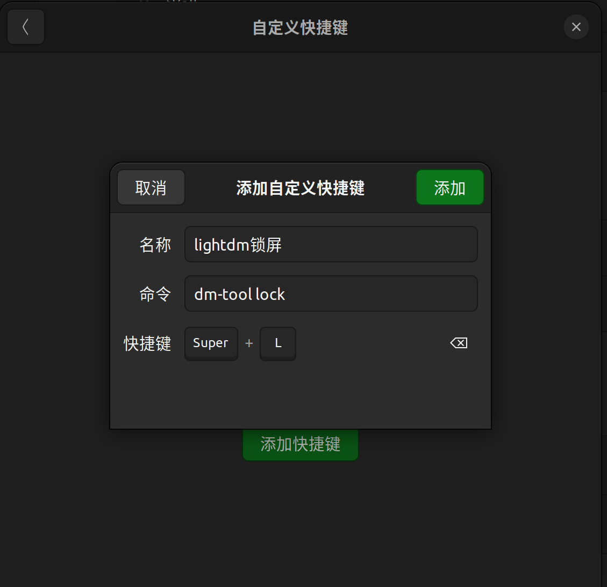

# 输入法无法切换中文

## 解决方案

目前gdm3无法使用中文，我使用的是lightdm屏幕管理器

使用搜狗输入法

安装搜狗输入法

```shell
sudo dpkg -i sogoupinyin_4.0.1.2800_x86_64.deb
```

主要是因为缺少包导致的

``` shell
sudo apt-get install libqt5qml5 libqt5quick5 libqt5quickwidgets5 qml-module-qtquick2
sudo apt install libgsettings-qt1
```

## 参考链接

[[1] wonghome. Ubuntu 18.04 安装搜狗输入法 [EB/OL].](https://blog.csdn.net/qq_39779233/article/details/127290795)
[[2] 雨中漫步-99. ubuntu系统安装好搜狗输入法后只能输入英文，无法输入中文的解决方案 [EB/OL]. ](https://blog.csdn.net/yuzhongmanbu99/article/details/127944446)

# 开机遇到grub>

## 双系统开机到grub的解决

1. 先在grub>输入ls，展示的是所有分区

2. 然后再ls (xxx,xxx)/boot/grub注意括号里面的应该填上自己分区名字，这一步是为了检查grub所在的具体分区，如果没有出现没有找到文件位置的提示，就说明找对了

3. 假如找到的分区为(hd1,gpt3)那么就运行set root=(hd1,gpt3)

4. 再输入set prefix=(hd1,gpt3)/boot/grub

5. 输入insmod normal，再输入normal

6. 就会到正常引导了

7. 进入linux系统后sudo update-grub再输入sudo grub-install /dev/sda

PS:出现这种情况的可能原因：win系统更新覆盖了，强制关闭linux，等等

# Linux安装MySQL

## Linux/UNIX 上安装 MySQL

```shell
sudo apt-get install mysql-server #默认最新版
```

安装依赖

```shell
sudo apt install libmysqlclient-dev
```

检查状态

```shell
sudo netstat -tap | grep mysql
```

当你在Ubuntu上使用sudo apt-get install mysql-server指令安装mysql后，你会发现你登录不上，会出现这样的情况。

```shell
hadoop@yjp:~$ mysql
ERROR 1045 (28000): Access denied for user 'yjp'@'localhost' (using password: NO)
hadoop@yjp:~$ mysql -uroot -p
Enter password: 
ERROR 1698 (28000): Access denied for user 'root'@'localhost'
```

使用上述指令安装mysql后，在安装过程中mysql数据库自动为你设置了账号密码，并放在了/etc/mysql/debian.cnf文件中

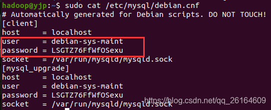

图中显示的就是默认随机的账户与密码，我们可以使用这组账号与面进行mysql登录

## 完全卸载MYSQL

#### 先卸载 mysql-common

```shell
sudo apt-get remove mysql-common
```

#### 然后再卸载

```shell
sudo apt-get autoremove --purge mysql-server-8.0
```

#### 最后清除残留数据

```shell
dpkg -l |grep ^rc|awk '{print $2}' |sudo xargs dpkg -P 
```

再用dpkg --list|grep mysql查看，还剩什么就卸载什么

## 修改数据库配置文件绕过密码登录

**不建议使用**

设置过程中因为绕过密码登录，会使root用户处于无密码状态，后期修改密码会报一个root处于无密码状态的错误，当然能解决。

当修改完密码后，还要将添加的内容注释掉，较为繁琐！

``` shell
sudo gedit /etc/mysql/mysql.conf.d/mysqld.cnf        # 这里你也可以用vim编辑器，都是一样的。
```

找到[mysqld]

添加如下内容：

```shell
skip-grant-tables
```

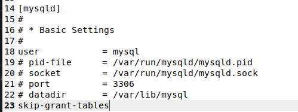

保存退出！重启mysql服务

```shell
service mysql restart
```

登录mysql

``` shell
mysql -uroot -p
```

密码随便输，直接就进去了！

## 修改MYSQL 用户密码

一、切换数据库

``` shell
use mysql
```

二、修改root用户密码

注意下面两条修改mysql root用户密码的命令只适用于mysql5.7版本及以下

这里你会发现你在网上搜出来的大部分修改面的命令都是

```mysql
update user set password=PASSWORD("123456") where user=root;                              --设置密码为123456
```

或者是

``` mysql
update user set authentication_string=PASSWORD(“123456”) where user=‘root’;              --设置密码为123456
```

如果你是mysql5.7用户及以下，上面两条指令适用于你！

执行完命令之后 flush privileges;  更新所有操作权限，重启数据库 service mysql restart 即可

mysql 5.7.9以后废弃了password字段和password()函数；authentication_string:字段表示用户密码，而authentication_string字段下只能是mysql加密后的41位字符串密码。

而我们一般现在使用指令安装mysql会默认安装最新版mysql8.0

修改mysql8.0 root用户密码正确打开方式

MySql 从8.0开始修改密码有了变化，在user表加了字段authentication_string，修改密码前先检查authentication_string是否为空

如果不为空，先置空字段在修改密码

```mysql
use mysql; 

update user set authentication_string='' where user='root';      --将字段置为空

alter user 'root'@'localhost' identified with mysql_native_password by '123456';  
 
--修改密码为123456
如果为空，则直接修改密码

alter user 'root'@'localhost' identified with mysql_native_password by '123456';   
--修改密码为123456
```


修改成功！

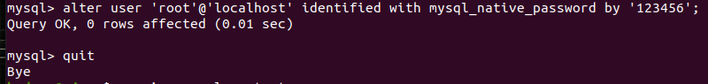

登陆成功！

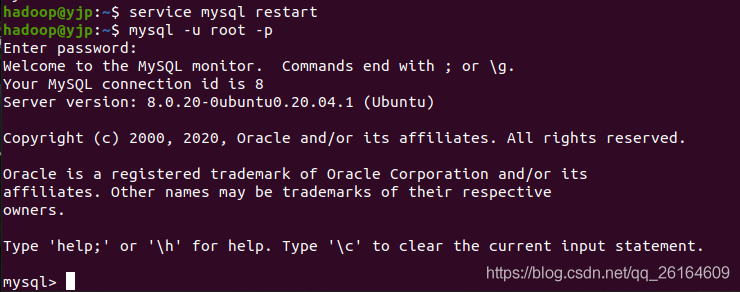

**如果出现下列错误：**

```mysql
ERROR 1290 (HY000): The MySQL server is running with the --skip-grant-tables option so it cannot execute this statement

```

这是由于你上面如果用的第二种方法设置绕过密码登录，这时root用户是无密码状态，会报这个错误！

这时，先执行

```mysql
flush privileges;

```

然后再执行修改密码命令就行了

```mysql
alter user 'root'@'localhost' identified with mysql_native_password by '123456';      --修改密码为123456
```

大功告成！

重启mysql

``` shell
service mysql restart
```

使用第一种方法直接查看mysql默认账户密码登录的则自动忽略下述内容！

如果你是修改的 /etc/mysql/mysql.conf.d/mysqld.cnf  文件设置绕过密码登录（即上述第二种方法进入数据库）

设置密码完毕后一定要将 skip-grant-tables 这句代码在文件中注释掉。

然后重启mysql

```shell
service mysql restart
```


## MYSQL无法读取本地文件文件

## 安全设置

如果你的系统启用了 SELinux 或 AppArmor，这些安全模块可能会影响文件访问权限。你可以通过禁用它们或者配置相应的规则来解决问题。

在使用 Ubuntu 或类似基于 Debian 的 Linux 发行版时，AppArmor 是一种应用程序安全框架，用于限制特定程序的活动。如果你需要禁用 AppArmor，可以按照以下步骤进行操作：

## 修改AppArmor配置文件

MySQL的AppArmor的配置文件是/etc/apparmor.d/usr.sbin.mysqld，其中usr.sbin.mysqld代表执行程序/usr/sbin/mysqld，也就是MySQL服务的主程序


第一行加入允许读取的数据文件夹

rwk表示

- r - 读取 - 读取数据的权限
- w - 写入 - 创建、删除、写入文件和扩展文件的权限

- k - lock - 锁定文件的权限，与 write perm 结合以确定它是否有权获取独占锁定

重启AppArmor

```text
sudo service apparmor reload
```

## 取消禁用AppArmor服务

### 1. 启用 AppArmor 服务：

```
bashCopy code
sudo systemctl enable apparmor
```

这将使 AppArmor 在系统启动时自动启动。

### 2. 启动 AppArmor 服务：

```
bashCopy code
sudo systemctl start apparmor
```

### 3. 检查 AppArmor 状态：

```
bashCopy code
sudo systemctl status apparmor
```

上述命令将显示 AppArmor 服务的当前状态。如果状态显示为 "active"，则表示 AppArmor 服务已成功启动。

### 4. 重新加载 AppArmor 配置（可选）：

在重新启用 AppArmor 后，你可以选择重新加载配置以使更改生效：

```
bashCopy code
sudo service apparmor reload
```

或者，如果你使用的是 systemd：

```
bashCopy code
sudo systemctl reload apparmor
```

这些步骤应该使 AppArmor 服务重新启用并运行。请注意，重新启用 AppArmor 服务可能会导致之前由 AppArmor 禁用的应用程序再次受到 AppArmor 的限制。确保你的应用程序配置适当，以适应 AppArmor 的规则。

### 禁用 AppArmor 服务：

1. **停止 AppArmor 服务：**

   ```
   bashCopy code
   sudo systemctl stop apparmor
   ```

2. **禁用 AppArmor 服务（可选）：**

   ```
   bashCopy code
   sudo systemctl disable apparmor
   ```

   这样系统启动时就不会加载 AppArmor 服务。

3. **重启计算机：**

   ```
   bashCopy code
   sudo reboot
   ```

### 卸载 AppArmor 软件包：

如果你希望彻底删除 AppArmor，而不仅仅是停止服务，可以执行以下步骤：

1. **卸载 AppArmor 软件包：**

   ```
   bashCopy code
   sudo apt-get purge apparmor
   ```

   这将删除 AppArmor 软件包及其配置文件。

2. **重启计算机：**

   ```
   bashCopy code
   sudo reboot
   ```

请注意，禁用或删除 AppArmor 可能会导致系统安全性降低，因为 AppArmor 的目的是提供一层额外的安全保护。在禁用或删除之前，请确保你理解了相关的风险，并确保你有其他安全机制来保护系统。

参考资料

[chatgpt](https://chat.openai.com/)

[AppArmor与MySQL](https://zhuanlan.zhihu.com/p/407785086)

### mysql的读取

mysql的位置

```shell
which mysql
```

输出目录

```shell
/usr/bin/mysql
```

```shell
# 查看 mysql 配置文件加载顺序
/usr/bin/mysql --verbose --help | grep -A 1 'Default options'
```

然后会出现一些信息

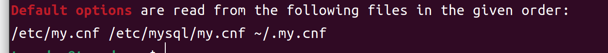

这个信息的意思是：

服务器首先读取的是 /etc/my.cnf 文件，如果前一个文件不存在则继续读 /etc/mysql/my.cnf 文件，依此类推，如若还不存在便会去读~/.my.cnf文件。

如果以上文件都不存在，则说明在对mysql编译完成之后你没有对mysql进行配置，需要你自己复制一份mysql提供的默认配置文件到上面提到的目录中，然后改名为my.cnf，修改文件的所有者和所属组并赋予执行权限。


```text
mkdir /usr/etc

cp /usr/support-files/my-default.cnf /usr/local/mysql/etc/my.cnf

chown -R mysql:mysql /usr/etc/

chmod 755 /usr/etc/my.cnf
```

完成以上操作之后，需要对my.cnf进行基本配置

```shell
vim /usr/etc/my.cnf
```

例如：

```text
basedir = /usr/local/mysql              # 指mysql的安装目录
datadir = /usr/local/mysql/data         # 指mysql的数据存放目录
port = 3306                             # 指mysql的监听端口
```

最后重启mysql使配置生效

```shell
/usr/support-files/mysql.server restart
```


如果修改my.cnf后mysql启动不了,可以通过如下方式查看错误信息

```shell
/usr/bin/mysqld --verbose --help | grep -A 1 'Default options'
```


### 修改mysql配置文件


将mysql的安全文件夹设置为mysql用户的

```shell
sudo chown -R mysql:mysql /mysql_data/
```

增加读写权限

```shell
sudo chmod -R 777 /mysql_data/
```

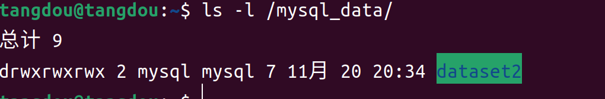

# GIT

## 别名

```shell
#查看当前所有远程地址别名
git remote -v 

git remote add [别名] [远程地址]

```

## git fatal: 拒绝合并无关的历史

出现这个错误的原因：本地初始化的项目 与 github 版本不一致, 导致无法提交
解决办法：在pull 时候, 添加–allow-unrelated-histories参数。

``` shell
git pull origin master --allow-unrelated-histories 
```

# QT6.61

## 安装完打不开的问题

#### 解决Qt出现qt.qpa.plugin:Could not load the Qt platform plugin "xcb"

qt.qpa.plugin: Could not load the Qt platform plugin "xcb" in "" even though it was found.
This application failed to start because no Qt platform plugin could be initialized. Reinstalling the application may fix this problem.

Available platform plugins are: eglfs, linuxfb, minimal, minimalegl, offscreen, vnc, xcb.

Aborted (core dumped)


```shell
root@node01:/home/Junjie/ovito-basic-3.9.4-x86_64/bin# ./ovito
qt.qpa.plugin: From 6.5.0, xcb-cursor0 or libxcb-cursor0 is needed to load the Qt xcb platform plugin.
qt.qpa.plugin: Could not load the Qt platform plugin "xcb" in "" even though it was found.
This application failed to start because no Qt platform plugin could be initialized. Reinstalling the application may fix this problem.
 
Available platform plugins are: minimal, wayland, xcb.
 
已放弃 (核心已转储)
```


### 定位问题

修改配置文件~/.bashrc：

```shell
vim ~/.bashrc
```

在最末尾添加如下语句，会在qtcreator启动时，列出详细的错误提示。

```shell
export QT_DEBUG_PLUGINS=1
```

保存退出编辑，使配置文件生效：

```shell
source ~/.bashrc
```

启动qtcreator会弹出如下详细错误信息：

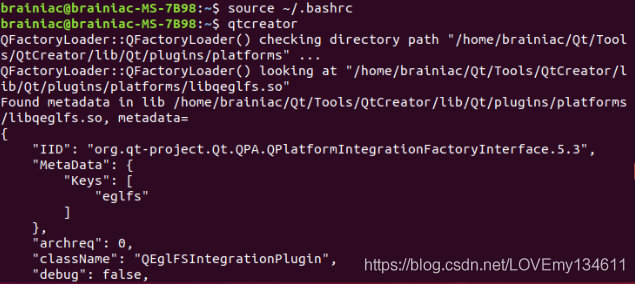

在打印的错误信息的最下面，找到了引发错误的真正原因：

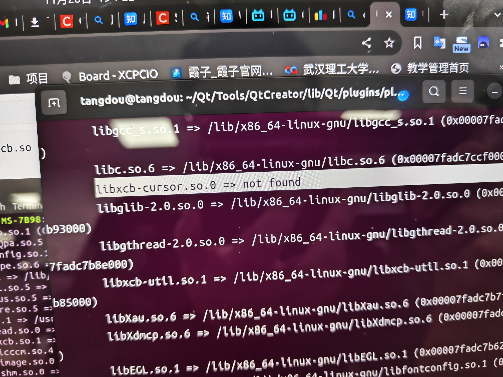

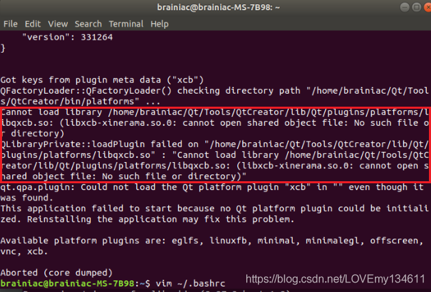

也就是Qt动态链接库的问题，当加载libqxcb.so库的时候，还需要加载libxcb-xinerama库。
切换到报错libxcb.so所在目录：

```shell
#替换为自己的报错目录
cd /home/tangdou/Qt/Tools/QtCreator/lib/Qt/plugins/platforms/
```

运行ldd libqxcb.so，查看关联内容：

```shell
ldd libqxcb.so
```


libxcb.cursor.so.0没有

### 解决方法

安装libxcb-cursor0库：

```shell
#如果还存在其他依赖库没有安装，也一并安装。
sudo apt-get install libxcb-cursor0
```

# PDF转图片

Pdftoppm是一个命令行工具，它可以将PDF文档页面转换为PNG等格式的图片。还可以指定图片的分辨率、比例和裁剪图片。

根据你的Linux发行版按照如下方式安装pdftoppm。

```shell
sudo apt install poppler-utils     [On Debian/Ubuntu & Mint]
sudo dnf install poppler-utils     [On RHEL/CentOS & Fedora]
sudo zypper install poppler-tools  [On OpenSUSE]  
sudo pacman -S poppler             [On Arch Linux]
```

## **将PDF文档转成图片**

将pdf转换为图片的命令如下：

```shell
pdftoppm -<image_format> <pdf_filename> <image_name>
pdftoppm -<image_format> <pdf_filename> <image_name>
```

在下列示例中，我的pdf文件名称是Linux_For_Beginners.pdf，我会将其转换为PNG格式并将图片命为Linux_For_Beginners。

```shell
pdftoppm -png Linux_For_Beginners.pdf Linux_For_Beginners
```

将pdf文件每一页都转换为png格式的图片，如Linux_For_Beginners-1.png、Linux_For_Beginners-2.png等。

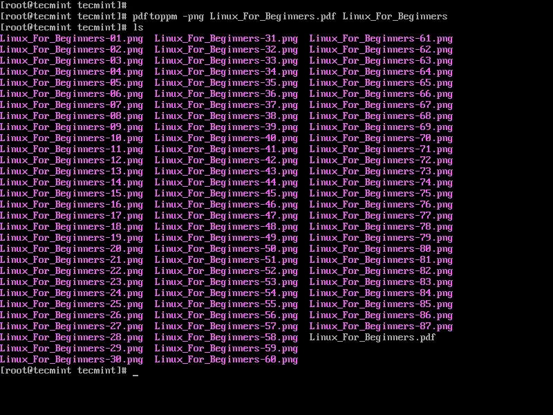

## **将指定范围内的页面转成图片**

命令如下：

```text
pdftoppm -<image_format> -f N -l N <pdf_filename> <image_name>
pdftoppm -<image_format> -f N -l N <pdf_filename> <image_name>
```

N为起始页编号， -l N 指定结束页编号。

在下面的例子中，我们将文件Linux_For_Beginners.pdf的第10页到第15页转换为PNG。

```text
pdftoppm -png -f 10 -l 15 Linux_For_Beginners.pdf Linux_For_Beginners
```

输出的图片名为Linux_For_Beginners-10.png，Linux_For_Beginners-11.png，等。


## **将pdf文件的第一页转成图片**

命令如下：

```shell
pdftoppm -png -f 1 -l 1 Linux_For_Beginners.pdf Linux_For_Beginners
```

## **调整转换图片的DPI质量**

Pdftoppm默认将PDF页面转换为DPI为150的图片。

如需要调整，使用参数选项"-rx"和"-ry"。

在这个例子中，我们将Linux_For_Beginners.pdf转换的图片DPI质量调整为300。

```shell
pdftoppm -png -rx 300 -ry 300 Linux_For_Beginners.pdf Linux_For_Beginners
```

要查看pdftoppm中可用和支持的所有选项，请运行以下命令：

```shell
pdftoppm --help  
man pdftoppm
```

# 强制结束程序

## 找到程序运行的进程号

```shell
sudo pgrep -f "software_name"
```

或者

```shell
sudo pidof software_name
```

## 杀死进程

```shell
# 使用 ps 命令找到进程号
ps aux | grep "process_name"

# 或者使用 pgrep 命令
pgrep -f "process_name"
```

强制 (PID为进程号)

```shell
kill -9 PID
#或者
pkill -9 "process_name"
```

